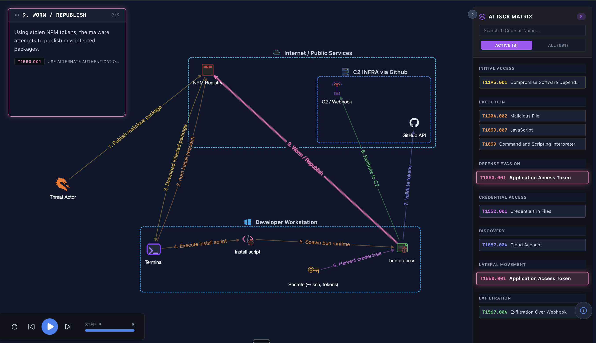

# Cerebra CmDB Marketplace

Community and curated CmDB profile packs for Cerebra.

This repository is the public content layer for the CmDB marketplace:
- command profiles
- command screenshots/assets
- command graph sidecars
- pack/version metadata
- global catalog index consumed by the app

Important: Cerebra graph rendering uses JSON scenario files. It does not consume Mermaid diagrams.

## Share From Cerebra (Recommended)

The recommended way to create and share CmDB packs is to work on your profile inside **Cerebra**, then export it to this repo format (and optionally open a PR) directly from the app UI.

### Where this lives in the Cerebra UI
- **Install packs**: `CmdDB` -> `Marketplace` (browse, Install/Update/Reinstall)
- **Share packs**: `CmdDB` -> `Profile Settings` -> `Marketplace Export`

### Step-by-step: share your profile
1. Build or update your profile in Cerebra (`CmdDB`).
2. (Optional) Add screenshots/assets:
   - add images to command descriptions in Cerebra (exported into `assets/` automatically)
   - **do not include secrets**, internal tokens, passwords, or private-only infrastructure
3. (Optional) Add a flow graph for key commands:
   - each command can have one graph JSON sidecar (see graph sections below)
4. Open `CmdDB` -> `Profile Settings` -> `Marketplace Export`.
5. Fill in:
   - **Publisher** + **Slug**: pack identity is `packId = <publisher>.<slug>` (lowercase, no spaces)
   - **Version**: use semver (`1.0.0`). If the pack already exists, Cerebra suggests the next version and blocks PRs that don’t bump.
6. Choose one:
   - **Export Pack**: writes pack files locally (useful if you want to inspect or submit manually)
   - **Export + Submit PR**: exports and opens a PR against this repo

### What Cerebra does for you
When you use the in-app export flow, Cerebra generates the exact marketplace pack structure and metadata:
- exports `profile.json` (and normalizes legacy fields like missing `description`)
- bundles profile assets (screenshots/images) from your local profile assets folder
- bundles per-command graph sidecars from your local profile graph folder
- generates `manifest.v1.json` with SHA-256 hashes for every file
- generates/updates `pack.json`
- on PR submit: updates `catalog/index.v1.json` and opens a pull request

### Screenshots and UI captures (recommended)
You can make reviews much faster by including screenshots:
- Command screenshots/images referenced by your profile (exported into `assets/` automatically).
- UI screenshots showing what changed (optional): add to `docs/images/` and link them in your PR.

If you are unsure what screenshots to include, open a PR without them and ask maintainers in the PR thread. We can request specific screenshots if needed.

## Contents
1. [Share From Cerebra (Recommended)](#share-from-cerebra-recommended)
2. [How It Works](#how-it-works)
3. [Repository Structure](#repository-structure)
4. [Pack Format Contract](#pack-format-contract)
5. [CmDB Graph Feature (In App)](#cmdb-graph-feature-in-app)
6. [Graph JSON Syntax (Current)](#graph-json-syntax-current)
7. [Graph JSON Example](#graph-json-example)
8. [Rendered Example](#rendered-example)
9. [Offensive Pack Example](#offensive-pack-example)
10. [Manual Submission (Advanced)](#manual-submission-advanced)
11. [How To Generate Graph JSON (Gemini/GPT)](#how-to-generate-graph-json-geminigpt)
12. [Acceptance Criteria](#acceptance-criteria)
13. [Versioning Rules](#versioning-rules)
14. [Troubleshooting](#troubleshooting)

---

## How It Works

Runtime flow in app:
1. App fetches `catalog/index.v1.json`.
2. User picks a pack.
3. App fetches pack `manifest.v1.json`.
4. App downloads `profile.json`, `assets/`, `graphs/` and verifies SHA-256 hashes.
5. Installed profile appears in CmDB profile selector.

Content path at install time:
- `catalog/index.v1.json` -> pack entry -> `manifest.v1.json`
- `manifest.profile` -> `profile.json`
- `manifest.assets[]` -> profile assets folder
- `manifest.graphs[]` -> profile graph folder

---

## Repository Structure

```text
cerebra-cmdb-marketplace/
├── catalog/
│   ├── index.v1.json
│   └── schema/
│       ├── catalog.schema.json
│       └── manifest.schema.json
├── packs/
│   └── <packId>/
│       ├── pack.json
│       └── versions/
│           └── <semver>/
│               ├── manifest.v1.json
│               ├── profile.json
│               ├── assets/
│               └── graphs/
├── docs/
│   └── images/
└── .github/workflows/
```

---

## Pack Format Contract

### Required files
1. `packs/<packId>/pack.json`
2. `packs/<packId>/versions/<version>/manifest.v1.json`
3. `packs/<packId>/versions/<version>/profile.json`

### Optional files
1. `packs/<packId>/versions/<version>/assets/*`
2. `packs/<packId>/versions/<version>/graphs/*`

### `profile.json` command requirements
Each command object must include:
- `id` (UUID string)
- `label` (string)
- `command` (string)
- `description` (string, may be empty `""`)
- `tags` (array of strings)
- `color` (optional hex color, example `#3b82f6`)

Important: `description` must be a string for every command. Missing description will fail marketplace install.

### Graph mapping rule
Graph files map by command id:
- Command id in profile: `87cb075c-f935-4e66-be0f-ba74c3779dd3`
- Graph file path in pack: `graphs/87cb075c-f935-4e66-be0f-ba74c3779dd3.json`
- Manifest entry must include matching `commandId` UUID.

---

## CmDB Graph Feature (In App)

How users work with graphs inside CmDB:
1. Open `CmdDB` and select a profile.
2. Edit a command (pencil icon) and paste JSON in `Flow Graph JSON`.
3. Save the command.
4. Click the `Network` icon on the command tile to open `Flow Graph` modal.
5. Use playback controls (reset/prev/play/next), step progress, and MITRE side panel.

What this means for marketplace packs:
- each command can have one graph JSON sidecar
- graph filename must match command id
- graph JSON should validate against Cerebra scenario schema

---

## Graph JSON Syntax (Current)

This reflects the current app parser/schema in Cerebra.

### Root object
- Required: `title`, `version`, `entities`, `steps`
- Optional: `description`, `shortDescription`, `tags`, `metadata`, `viewport`, `visibility`, `stepInfoPosition`, `stepInfoSize`
- Recommended: `version: "3.0"`

### `entities`
Array of graph entities. Supported `type` values:
- `node`
- `container`
- `text_box`

Common fields:
- `id` (string)
- `label` (string)
- `position` optional: `{ "x": number, "y": number }`
- `icon` optional: icon key string (example `IconKali`, `IconServer`, `IconExploit`)

Container-specific fields:
- `members` (array of child entity ids)
- optional `width`, `height`, `style`, `color`

### `steps`
Timeline array. Supported step `type` values:
- `edge`
- `show_text`

`edge` step fields:
- `id` (number, start at 1)
- `name` (string)
- `from` (entity id)
- `to` (entity id)
- optional `icon`, `description`, `tooltip`, `cli`, `mitre`

`show_text` step fields:
- `id` (number)
- `name` (string)
- `target_entity` (entity id)
- `content` (string)
- optional `style`, `mitre`

### `visibility`
Use entity-keyed visibility ranges:

```json
"visibility": {
  "entity_id": { "start": 0, "end": 100 }
}
```

Do not use step-keyed format like `"0": ["node1"]`.

---

## Graph JSON Example

```json
{
  "title": "NTLM Relay Mini Scenario",
  "version": "3.0",
  "description": "Minimal valid JSON scenario for CmDB graph rendering.",
  "entities": [
    {
      "id": "attacker_zone",
      "type": "container",
      "label": "Attacker Environment",
      "icon": "IconKali",
      "members": ["attacker_host"]
    },
    {
      "id": "attacker_host",
      "type": "node",
      "label": "Kali Linux",
      "icon": "IconKali"
    },
    {
      "id": "target_server",
      "type": "node",
      "label": "Target SMB Server",
      "icon": "IconServer"
    }
  ],
  "visibility": {
    "attacker_zone": { "start": 0, "end": 100 },
    "attacker_host": { "start": 0, "end": 100 },
    "target_server": { "start": 0, "end": 100 }
  },
  "steps": [
    {
      "id": 1,
      "type": "edge",
      "name": "Probe SMB",
      "from": "attacker_host",
      "to": "target_server",
      "cli": "nmap --script=smb2-security-mode.nse -p445 10.0.2.73",
      "icon": "IconExploit",
      "mitre": {
        "id": "T1046",
        "tactic": "Discovery",
        "technique": "Network Service Scanning"
      }
    }
  ]
}
```

---

## Rendered Example

Rendered graph example from Cerebra graph engine:



Source image was taken from main project prompt assets:
- `AI-Prompt-Graphs-CmDB/shai-hulud-graph-rendered`

---

## Offensive Pack Example

Reference pack in this repo:
- Pack folder: [`packs/cerebra.offensive`](packs/cerebra.offensive)
- Version: [`packs/cerebra.offensive/versions/1.0.0`](packs/cerebra.offensive/versions/1.0.0)
- Profile JSON: [`packs/cerebra.offensive/versions/1.0.0/profile.json`](packs/cerebra.offensive/versions/1.0.0/profile.json)
- Manifest: [`packs/cerebra.offensive/versions/1.0.0/manifest.v1.json`](packs/cerebra.offensive/versions/1.0.0/manifest.v1.json)
- Graph example: [`packs/cerebra.offensive/versions/1.0.0/graphs/87cb075c-f935-4e66-be0f-ba74c3779dd3.json`](packs/cerebra.offensive/versions/1.0.0/graphs/87cb075c-f935-4e66-be0f-ba74c3779dd3.json)

Command screenshot asset examples:


---

## Manual Submission (Advanced)

Use this only if you can’t use the in-app PR submission.

### Option A: Export from Cerebra, submit PR manually
1. Use `Export Pack` in Cerebra (Profile Settings -> Marketplace Export).
2. Copy the exported files into your fork of this repo.
3. Open a PR.

This path is still “manual PR”, but avoids all the error-prone steps like hashing files and building manifests by hand.

### Option B: Fully manual pack creation
If you build packs by hand, follow the **Pack Format Contract** above:
- keep directory layout correct under `packs/<packId>/versions/<version>/`
- ensure every command in `profile.json` has a string `description`
- ensure graph filenames match command ids
- ensure every file hash in `manifest.v1.json` matches the file
- update `catalog/index.v1.json` to point to the correct `manifestUrl`

### PR requirements
1. One logical change per PR (new pack or single pack version update).
2. Include clear summary:
   - pack id
   - version
   - what changed
3. Confirm data safety:
   - no credentials
   - no private/internal targets
   - no proprietary or stolen content

### PR checklist template
- [ ] `profile.json` is valid JSON
- [ ] all commands have string `description`
- [ ] command ids are unique
- [ ] graph filenames map to existing command ids
- [ ] graph JSON is valid scenario syntax
- [ ] manifest hashes match files
- [ ] catalog entry points to correct manifest URL

---

## How To Generate Graph JSON (Gemini/GPT)

Use your prompt kit from Cerebra main project (`AI-Prompt-Graphs-CmDB/`) and generate one JSON file per command id.

### Practical workflow
1. Pick a command from `profile.json`.
2. Provide command intent, prerequisites, and expected attack path to Gemini/GPT.
3. Ask for strict JSON output only (no markdown fences).
4. Save output to `graphs/<command-id>.json`.
5. Validate output before committing.

### Validation command
From the Cerebra project:

```bash
node AI-Prompt-Graphs-CmDB/validate-output.cjs graphs/<command-id>.json
```

### Recommended constraints for prompts
- Return valid JSON only.
- Use `version: "3.0"`.
- Use only supported entity types (`node`, `container`, `text_box`).
- Use only supported step types (`edge`, `show_text`).
- Keep visibility entity-keyed.

---

## Acceptance Criteria

Maintainers review packs against these gates:
1. Structural correctness
   - repository layout and metadata are valid
2. Data quality
   - commands are meaningful and executable
   - tags and descriptions are useful
3. Graph quality (if included)
   - graph files match command ids
   - graph JSON renders in CmDB graph viewer
   - step references point to existing entities
4. Safety and compliance
   - no secrets, private credentials, or illegal content
5. Reusability
   - pack is broadly useful to practitioners

Packs may be accepted with requested changes (rename, metadata cleanup, version fix, hash fix).

---

## Versioning Rules

Use semantic versioning per pack:
1. `PATCH` (`1.0.0 -> 1.0.1`)
   - metadata fixes, hash fixes, non-breaking cleanup
2. `MINOR` (`1.0.0 -> 1.1.0`)
   - new commands/graphs added, backward compatible
3. `MAJOR` (`1.0.0 -> 2.0.0`)
   - significant command set redesign/breaking changes

Always:
1. create a new version folder
2. update `pack.json` `latestVersion`
3. regenerate manifest hashes
4. update catalog entry

---

## Troubleshooting

### Install fails with profile schema errors
Cause: profile has invalid command field types (usually missing `description`).

If you used Cerebra in-app export, this should be automatically normalized.
If you built the pack manually, fix missing descriptions like this:

```bash
jq 'map(.description = (.description // ""))' profile.json > profile.fixed.json
```

### Graph is installed but not rendering in viewer
1. Ensure graph filename exactly matches command id.
2. Ensure `steps.from/to/target_entity` reference existing entity ids.
3. Ensure JSON uses supported fields and types.
4. Ensure graph file is listed in manifest with correct hash and `commandId`.

### Pack does not appear in app
1. Verify `catalog/index.v1.json` has your pack entry.
2. Verify `manifestUrl` is reachable in browser.
3. Refresh marketplace in app.
4. If using CDN URL, allow cache propagation or use raw GitHub URL override temporarily.

---

## Maintainer Note

Current scripts in `scripts/` are placeholders and will be upgraded to strict validators.
Until then, maintainers perform manual validation plus spot checks before merge.
