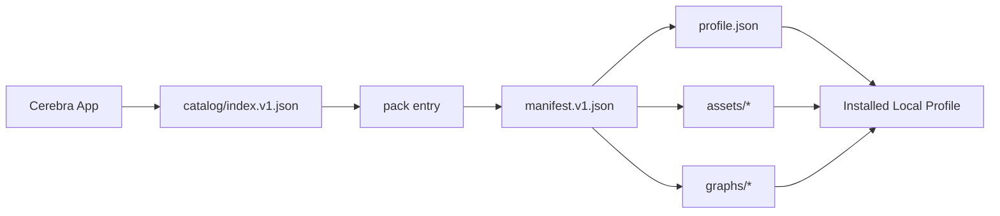
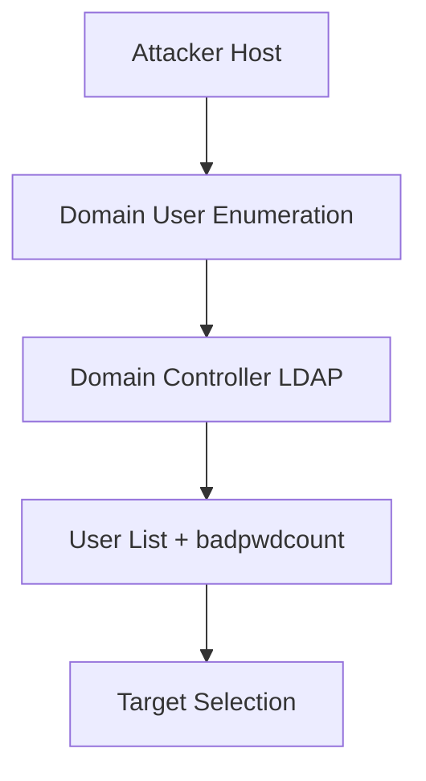
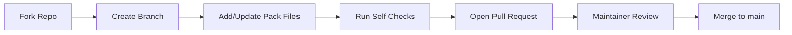

# Cerebra CmDB Marketplace

Community and curated CmDB profile packs for Cerebra.

This repository is the public content layer for the CmDB marketplace:
- command profiles
- command screenshots/assets
- command graph sidecars
- pack/version metadata
- global catalog index consumed by the app

## Contents
1. [How It Works](#how-it-works)
2. [Repository Structure](#repository-structure)
3. [Pack Format Contract](#pack-format-contract)
4. [Offensive Pack Example](#offensive-pack-example)
5. [How To Create A New Profile Pack](#how-to-create-a-new-profile-pack)
6. [How To Generate Graph JSON (Gemini/GPT)](#how-to-generate-graph-json-geminigpt)
7. [How To Submit A Pack](#how-to-submit-a-pack)
8. [Acceptance Criteria](#acceptance-criteria)
9. [Versioning Rules](#versioning-rules)
10. [Troubleshooting](#troubleshooting)

---

## How It Works



Runtime flow in app:
1. App fetches `catalog/index.v1.json`.
2. User picks a pack.
3. App fetches pack `manifest.v1.json`.
4. App downloads `profile.json`, `assets/`, `graphs/` and verifies SHA-256 hashes.
5. Content is installed locally and appears in CmDB profile selector.

---

## Repository Structure

```text
cerebra-cmdb-marketplace/
├── catalog/
│   ├── index.v1.json
│   └── schema/
│       ├── catalog.schema.json
│       └── manifest.schema.json
├── packs/
│   └── <packId>/
│       ├── pack.json
│       └── versions/
│           └── <semver>/
│               ├── manifest.v1.json
│               ├── profile.json
│               ├── assets/
│               └── graphs/
├── scripts/
└── .github/workflows/
```

---

## Pack Format Contract

### Required files
1. `packs/<packId>/pack.json`
2. `packs/<packId>/versions/<version>/manifest.v1.json`
3. `packs/<packId>/versions/<version>/profile.json`

### Optional files
1. `packs/<packId>/versions/<version>/assets/*`
2. `packs/<packId>/versions/<version>/graphs/*`

### `profile.json` command requirements
Each command object must include:
- `id` (UUID string)
- `label` (string)
- `command` (string)
- `description` (string, may be empty `""`)
- `tags` (array of strings)
- `color` (optional hex color, example `#3b82f6`)

Important: `description` must be a string for every command. Missing description will fail marketplace install.

### Graph mapping rule
Graph files map by command id:
- Command id in profile: `87cb075c-f935-4e66-be0f-ba74c3779dd3`
- Graph file path: `graphs/87cb075c-f935-4e66-be0f-ba74c3779dd3.json`

---

## Offensive Pack Example

Reference pack in this repo:
- Pack folder: [`packs/cerebra.offensive`](packs/cerebra.offensive)
- Version: [`packs/cerebra.offensive/versions/1.0.0`](packs/cerebra.offensive/versions/1.0.0)
- Profile JSON: [`packs/cerebra.offensive/versions/1.0.0/profile.json`](packs/cerebra.offensive/versions/1.0.0/profile.json)
- Manifest: [`packs/cerebra.offensive/versions/1.0.0/manifest.v1.json`](packs/cerebra.offensive/versions/1.0.0/manifest.v1.json)
- Graph example: [`packs/cerebra.offensive/versions/1.0.0/graphs/87cb075c-f935-4e66-be0f-ba74c3779dd3.json`](packs/cerebra.offensive/versions/1.0.0/graphs/87cb075c-f935-4e66-be0f-ba74c3779dd3.json)

### Visual examples from offensive pack

Command screenshot asset examples:


### Example graph concept



---

## How To Create A New Profile Pack

### Step 1: Prepare profile content
1. Build and validate your profile in Cerebra locally.
2. Export/copy profile JSON from local config folder.
3. Ensure every command has a string `description`.

Quick normalization command if needed:

```bash
jq 'map(.description = (.description // ""))' profile.json > profile.fixed.json
```

### Step 2: Create pack directory

Example for `cerebra.examplepack` version `1.0.0`:

```text
packs/cerebra.examplepack/
├── pack.json
└── versions/1.0.0/
    ├── profile.json
    ├── assets/
    ├── graphs/
    └── manifest.v1.json
```

### Step 3: Add `pack.json`

```json
{
  "packId": "cerebra.examplepack",
  "publisher": "your-name",
  "license": "CC BY-NC-SA 4.0",
  "homepage": "https://github.com/your-user/cerebra-cmdb-marketplace",
  "latestVersion": "1.0.0"
}
```

### Step 4: Add `manifest.v1.json`
Include hash entries for:
- `profile.json`
- each file in `assets/`
- each file in `graphs/`

Hash command examples:

```bash
shasum -a 256 profile.json
shasum -a 256 assets/*.png
shasum -a 256 graphs/*.json
```

### Step 5: Update catalog index
Add your pack entry in `catalog/index.v1.json` with:
- `packId`
- `displayName`
- `latestVersion`
- `manifestUrl`

Use jsDelivr URL format:

```text
https://cdn.jsdelivr.net/gh/<owner>/cerebra-cmdb-marketplace@main/packs/<packId>/versions/<version>/manifest.v1.json
```

---

## How To Generate Graph JSON (Gemini/GPT)

Graph generation is designed to be AI-assisted.

Use your prompt kit from Cerebra main project (`AI-Prompt-Graphs-CmDB/`) and generate one JSON file per command id.

### Practical workflow
1. Pick a command from `profile.json`.
2. Provide command, objective, prerequisites, and environment to Gemini/GPT.
3. Ask for strict JSON output only.
4. Save output to:
   - `graphs/<command-id>.json`
5. Validate JSON parses correctly.

### Recommended prompt constraints
- Return valid JSON only.
- Include clear attack flow entities and steps.
- Include metadata useful for analyst explanation.
- Use deterministic ids (stable references across steps).

### Graph quality checklist
1. Graph file name equals command `id`.
2. JSON is parseable.
3. Logical flow is clear and reproducible.
4. No secrets, private infrastructure names, or internal IPs.

---

## How To Submit A Pack

### Contribution flow


### PR requirements
1. One logical change per PR (new pack or single pack version update).
2. Include clear summary:
   - pack id
   - version
   - what changed
3. Confirm data safety:
   - no credentials
   - no private/internal targets
   - no proprietary or stolen content

### PR checklist template
- [ ] `profile.json` is valid JSON
- [ ] all commands have string `description`
- [ ] command ids are unique
- [ ] graph filenames map to existing command ids
- [ ] manifest hashes match files
- [ ] catalog entry points to correct manifest URL

---

## Acceptance Criteria

Maintainers review packs against these gates:
1. Structural correctness
   - repository layout and metadata are valid
2. Data quality
   - commands are meaningful and executable
   - tags and descriptions are useful
3. Safety and compliance
   - no secrets, private credentials, or illegal content
4. Reusability
   - pack is broadly useful to practitioners
5. Graph consistency (if included)
   - graph files match command ids and provide coherent flows

Packs may be accepted with requested changes (rename, metadata cleanup, version fix, hash fix).

---

## Versioning Rules

Use semantic versioning per pack:
1. `PATCH` (`1.0.0 -> 1.0.1`)
   - metadata fixes, hash fixes, non-breaking cleanup
2. `MINOR` (`1.0.0 -> 1.1.0`)
   - new commands/graphs added, backward compatible
3. `MAJOR` (`1.0.0 -> 2.0.0`)
   - significant command set redesign/breaking changes

Always:
1. create a new version folder
2. update `pack.json` `latestVersion`
3. regenerate manifest hashes
4. update catalog entry

---

## Troubleshooting

### Install fails with schema errors
Cause: profile has invalid command field types (usually missing `description`).

Fix:
```bash
jq 'map(.description = (.description // ""))' profile.json > profile.fixed.json
```

### Pack does not appear in app
1. Verify `catalog/index.v1.json` has your pack entry.
2. Verify `manifestUrl` is reachable in browser.
3. Refresh marketplace in app.
4. If using CDN URL, allow cache propagation or use raw GitHub URL override temporarily.

### Graph not showing
1. Ensure graph filename exactly matches command id.
2. Ensure graph JSON is valid.
3. Ensure command exists in same profile version.

---

## Maintainer Note

Current scripts in `scripts/` are placeholders and will be upgraded to strict validators.
Until then, maintainers perform manual validation plus spot checks before merge.
